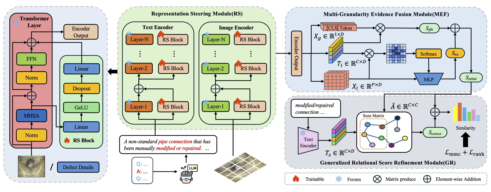

# SFR-Net: Steering-Fusion-Refining Network in Multi-label Zero-Shot Sewer Defect Detection

Official implementation of the [paper](https://openreview.net/forum?id=u2iaMfTuxR&referrer=%5BAuthor%20Console%5D(%2Fgroup%3Fid%3Dthecvf.com%2FCVPR%2F2026%2FConference%2FAuthors%23your-submissions)) in CVPR 2026.

## Introduction

Addressing the prohibitive costs of data annotation and the scarcity of sewer defect samples, we propose **SFR-Net**, a novel Multi-Label Zero-Shot Learning (ML-ZSL) framework. To mitigate "Alignment Ambiguity" in complex pipe environments, SFR-Net employs a three-stage paradigm: **Representation Steering (RS)** for scene adaptation, **Multi-Granularity Evidence Fusion (MEF)** for decoupled feature aggregation, and **Generalized Relational Score Refining (GR)** for transferring relational logic to unseen defects. Experiments on the Sewer-ML and WZ-Pipe datasets demonstrate that SFR-Net achieves state-of-the-art (SOTA) performance and significantly boosts zero-shot generalization.



## Installation

### 📂 Datasets

#### Sewer-ML

a large-scale, multi-label benchmark dataset specifically designed for **sewer pipe defect classification**. It contains over **1.3 million images** with **17 distinct defect categories**. We select the five least-frequent categories as the unseen defects, ensuring no
corresponding samples exist in the training set.

[[Dataset]](https://vap.aau.dk/sewer-ml/)
 [[Split]](https://drive.google.com/drive/folders/1f1v4uqJxapUtqDqL4ipffOzZOMV8NHle?usp=drive_link)

#### WZ-Pipe

a distinct dataset that employs different inspection standards from **Sewer-ML**. Specifically, the standards followed by **WZ-Pipe** feature more detailed and well-defined defect categories. It comprises approximately **60,000 samples** across **17 categories**, with the partition of unseen classes remaining consistent with that of Sewer-ML to ensure experimental comparability. 

Download the dataset from the following links:

 [[MEGA]](https://mega.nz/file/61AVQDbC#JWGWyODueoGRv2OV9MwRUvsMuxD4nQyUN5KiLUIxoiM) [[Baidu Netdisk]](https://pan.baidu.com/s/1jkgmBJvQ9IR3abE_7nngIg?pwd=cvpr)

**Note on Dataset Versioning**

The current release is a refined version of the dataset reported in the paper. We have performed a second round of re-annotation and removed low-quality or privacy-sensitive samples for better usability and safety.

**Result on refined WZ-Pipe Dataset**
| | | | | | | | | | | | | | | | |
|----|----|----|---|---|---|---|---|---|---|---|---|---|---|---|---|
| Method | P@1 | R@1 | F1@1 | P@3 | R@3 | F1@3 | mAP | P@3 | R@3 | F1@3 | P@5 | R@5 | F1@5 | mAP |
| Ours | 5.13 | 13.68 | 7.46 | 6.55 | 52.42 | 11.65 | 8.25 | 26.72 | 54.23 | 35.80 | 19.74 | 66.76 | 30.47 | 26.06 |

### ⚙️ Enviroment

Install the environment through conda:

```shell
conda env create -f environment.yml
```

### 📦 Pretrained Model
| Backbone | Dataset  | Resolution| mAP(ZSL/GZSL) |Download | 
|----------|-----------------------|---------- | ---------- | ----------|
| ViT-B/16 | Sewer-ML | 224x224 | 12.58/43.28 |[[Google Drive]](https://drive.google.com/file/d/1uSJDR-x-lCZeUSlT5lpJW-J-KH0i74Fv/view?usp=sharing) [[Baidu Netdisk]](https://pan.baidu.com/s/18dF4J-jMvdGbIFafg-6sJQ?pwd=cvpr) |

---

## 🚀 Running

### Multi-GPU training

```shell
CUDA_VISIBLE_DEVICES=0,1,2,3 torchrun --nproc_per_node=4 --master_addr=localhost --master_port=12355 \
main_mlzsl.py --config_file configs/sewerml.yml
```

### Multi-GPU evaluation

```shell
CUDA_VISIBLE_DEVICES=0,1,2,3 torchrun --nproc_per_node=4 --master_addr=localhost --master_port=12355 \
main_mlzsl.py --config_file configs/sewerml.yml MODEL.LOAD True TEST.EVAL True TEST.WEIGHT sewerml_best.pth
```

### Single-GPU evaluation
```shell
python main_mlzsl.py --config_file configs/sewerml.yml MODEL.DIST_TRAIN False MODEL.LOAD True TEST.EVAL True TEST.WEIGHT sewerml_best.pth
```

## 🙏 Acknowledgements

This repo benefits from [RAM](https://github.com/muzairkhattak/multimodal-prompt-learning), [CLIP](https://github.com/xmed-lab/CLIP_Surgery) and [CLIP-Adapter](https://github.com/gaopengcuhk/CLIP-Adapter). Thanks for their wonderful works.